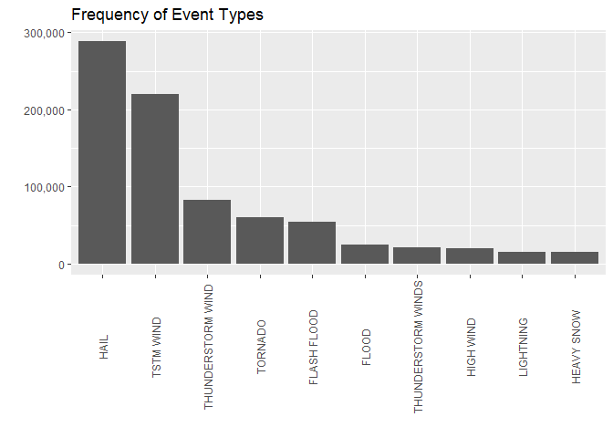
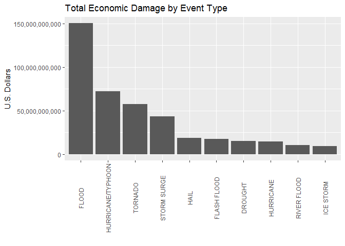

# Storms: An Analysis of Storms on Population Health and Economics
Andy Jeffreys  
May 24, 2017  


## Synopsis 

By exploring the U.S. National Oceanic and Atmospheric Administration's (NOAA) storm database, this study attempts to determine which types of weather events are most harmful with respect to population health and which types of events have the greatest economic consequences. Note that the data analyzed dates back to 1951 and only includes U.S. locations.

By exploring the data, this study concludes that Tornados cause the most harm to population health, while Floods cause the greatest economic consequences.

## Data Processing

I first loaded the dataset and aggregated total Injuries and Fatalities by Event Type. Ranking on this total of population harm, I created a subset dataframe of top ten event types which I thought to be a suitable amount for plotting.

```r
download.file("https://d396qusza40orc.cloudfront.net/repdata%2Fdata%2FStormData.csv.bz2","repdata_data_StormData.csv.bz2")
dataFile<-"repdata_data_StormData.csv.bz2"
data<-read.csv(dataFile,header = TRUE)
injuries<-aggregate(INJURIES~EVTYPE,data,sum)
fatalaties<-aggregate(FATALITIES~EVTYPE,data,sum)
fatalaties_injuries<-merge(x=fatalaties,y=injuries,by="EVTYPE",all=TRUE)
fatalaties_injuries$total<-rowSums(fatalaties_injuries[,c("FATALITIES", "INJURIES")], na.rm=T)
fatalaties_injuries<-fatalaties_injuries[order(-fatalaties_injuries$total),]
fatalaties_injuries_top<-fatalaties_injuries[1:10,]
```

It quickly becomes apparent that the Event Types are not consistently named and/or have many minor iterations of the same Event. A broad analysis would warrant some consolidation of the Event type factor. If I were to take a deeper dive into this analysis, I would consolidate the levels of the factor EVTYPE. However, in the spirit of getting this assignment completed in a reasonable timeframe, I'm electing to use the Event Types as they are. However I do want to display the huge array of potential values for type.


```r
length(levels(data$EVTYPE))
```

```
## [1] 985
```

To illustrate the ten most common types of Events, I've summed up the rows by type.

```r
data$row<-1
hist<-aggregate(row~EVTYPE,data,sum)
hist<-hist[order(-hist$row),]
hist<-hist[1:10,]
library(ggplot2)
library(scales)
ggplot(hist, aes(x=reorder(hist$EVTYPE,-hist$row),y=hist$row))+geom_bar(stat="identity")+theme(axis.text.x=element_text(angle = 90, vjust = 0.5))+xlab("")+ylab("COUNT")+scale_y_continuous(name="",labels=comma)+labs(title="Frequency of Event Types")
```

<!-- -->

Next, we need to create a dataset that sums up the economic damage by Event Type. This is done by combining Property and Crop damage into a Total column. I made some inferences that the levels ["B","H","M","K",et al] of the 'DMGEXP' columns for Property and Crops, indicate billion, hundred, million, thousand, et al. I multipled the crop and property damage value by a corresponding quantity factor, then added Property and Crops together to create a total economic cost per event, then summed all totals up by Event Type.


```r
data$propTot<-ifelse(data$PROPDMGEXP=="B",data$PROPDMG*1000000000,ifelse(data$PROPDMGEXP=="h",data$PROPDMG*100,ifelse(data$PROPDMGEXP=="H",data$PROPDMG*100,ifelse(data$PROPDMGEXP=="K",data$PROPDMG*1000,ifelse(data$PROPDMGEXP=="m",data$PROPDMG*1000000,ifelse(data$PROPDMGEXP=="M",data$PROPDMG*1000000,data$PROPDMG))))))

data$cropTot<-ifelse(data$CROPDMGEXP=="B",data$CROPDMG*1000000000,ifelse(data$CROPDMGEXP=="k",data$CROPDMG*1000,ifelse(data$CROPDMGEXP=="K",data$CROPDMG*1000,ifelse(data$CROPDMGEXP=="m",data$CROPDMG*1000000,ifelse(data$CROPDMGEXP=="M",data$CROPDMG*1000000,data$CROPDMG)))))

data$dmgTot<-data$cropTot+data$propTot

econDmg<-aggregate(dmgTot~EVTYPE,data,sum)

econDmg<-econDmg[order(-econDmg$dmgTot),]

econDmg<-econDmg[1:10,]
```

## Results

Combining Injuries and Fatalities and looking how the totals compare across various Weather Event Types, it is apparent that Tornados cause the greatest impact to Health by at least tenfold.

```r
ggplot(fatalaties_injuries_top, aes(x=reorder(fatalaties_injuries_top$EVTYPE,-fatalaties_injuries_top$total),y=fatalaties_injuries_top$total))+geom_bar(stat="identity")+theme(axis.text.x=element_text(angle = 90, vjust = 0.5))+xlab("")+scale_y_continuous(name="Combined Injuries and Fatalities",labels=comma)+labs(title="Total Harm to Population Health by Event Type")
```

<!-- -->

Combining the dollar amounts for property and crop damage totals and seeing how different Weather Event Types compare, Floods are clearly the most destructive weather event financially.


```r
ggplot(econDmg, aes(x=reorder(econDmg$EVTYPE,-econDmg$dmgTot),y=econDmg$dmgTot))+geom_bar(stat="identity")+theme(axis.text.x=element_text(angle = 90, vjust = 0.5))+xlab("")+scale_y_continuous(name="U.S. Dollars",labels=comma)+labs(title="Total Economic Damage by Event Type")
```

<!-- -->
